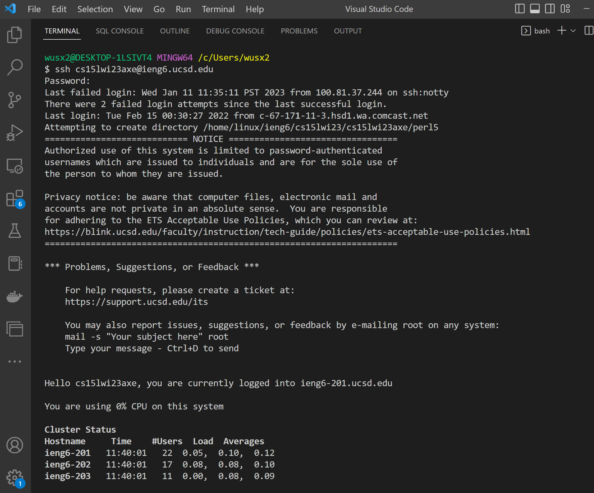

# CSE15l Lab Reports
### Shixuan Wu

<br/><br/>
## Installing VScode
---
## Remotely Connecting

---
## Trying Some Commands
---
[Link](https://github.com/wsx2021)
> Blockquote
* List 
* List 
1. one
2. Two
`Inline code`
```
# code block
print '3 backticks or'
print 'indent 4 spaces'
```
