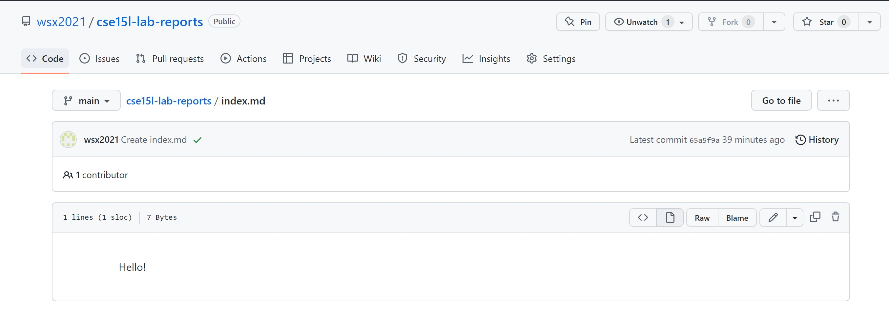

# CSE15L Lab Reports
### Shixuan Wu

<br/><br/>
## Repo
#### Here is what I saw for the index.md

<br/>
<br/>
---
## Example Markdown
> Blockquote
* List 
* List 
1. one
2. Two
`Inline code`
```
# code block
print '3 backticks or'
print 'indent 4 spaces'
```

[Link](https://github.com/wsx2021)