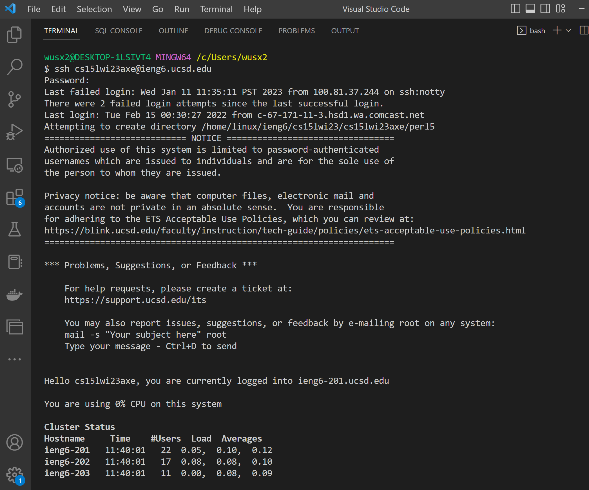

# CSE15L Lab Reports
### Shixuan Wu
&nbsp;
&nbsp;
## Installing VScode
#### Go to the Visual Studio Code website https://code.visualstudio.com/, and follow the instructions to download and install it on your computer.
#### I installed VScode for my previous class, and here is the screenshot for my VScode. 
#### After installed, Here is what I saw. 
#### As you can see, there is explorer pages to see the files within the folder and one panel for the code. 

---
## Remotely Connecting
#### I log into my educartional technology servies account to check for my account name. 
#### Then, I first changed the course password for the course, and wait. 
#### I open the bash terminal in the VScode and use `ssh cs15lwi23axe@ieng6.ucsd.edu` to log into the cloud computer. 

---
## Trying Some Commands

#### Run `ls -l`and l here means longer format. 

&nbsp;
#### Run `ls -lat`and this show all hiden files in the time order. 

&nbsp;
#### Run `cd` and this show all files in the folder. I use `touch` to create a new file in teh public directory , but fails. 

